# T5 Studio — Inferencia texto a texto con T5-small

Proyecto final del curso **Procesamiento de Datos Secuenciales** (Maestría en Inteligencia Artificial y Ciencia de Datos, UAO). Implementamos la inferencia de **T5-small (Text-to-Text Transfer Transformer)**, analizamos su mecanismo de atención por dentro y lo desplegamos en una interfaz web para **resumir textos en inglés** y **traducir de inglés a alemán** con el mismo modelo, cambiando únicamente el prefijo de la instrucción.

**Integrantes:** Omar Sánchez Jimenez, Santiago Correa Campaña, Jorge Herrera y Wilson Jesus Riveros  
**Modelo:** `google-t5/t5-small`  
**Aplicación Streamlit:** https://t5studio-kqrgtyrngcufth73ewhoyp.streamlit.app/
**Artículo base:** *Exploring the Limits of Transfer Learning with a Unified Text-to-Text Transformer*  
**Repositorio original:** https://github.com/google-research/text-to-text-transfer-transformer

---

## 1. Resumen (Abstract)

En este trabajo tomamos T5-small, la versión de 60 millones de parámetros de la familia T5 de Raffel *et al.*, y lo usamos para inferencia sin entrenarlo. En T5 la entrada y la salida siempre son texto, y la tarea se le indica al modelo con un prefijo como `summarize:` o `translate English to German:`.

Además de ejecutar la inferencia, abrimos el modelo para entenderlo: seguimos las dimensiones de los tensores capa por capa, calculamos a mano la atención del primer bloque (Q, K, V, el sesgo de posición relativa y el softmax) y comprobamos que coincide con la del modelo, visualizamos lo que mira cada cabeza, la máscara del decoder y la atención cruzada en una traducción, y reconstruimos la generación token por token con sus probabilidades. También mostramos cómo la atención cambia el significado de una palabra ambigua (*bank*) según la frase.

Construimos una interfaz en Streamlit, **T5 Studio**, donde se escribe o se carga un archivo de texto, se escoge la tarea, se ejecuta la inferencia y se ven la predicción, los tokens, el tiempo y un mapa de atención cruzada. Por último medimos la calidad sobre muestras de 20 ejemplos: en resumen (CNN/DailyMail) obtuvimos ROUGE-1/2/L de 33,9 / 13,4 / 24,2, y en traducción (WMT14 EN→DE) un BLEU de 18,3 y un chrF de 54,9. Los resultados muestran que T5-small traduce frases sencillas con buena calidad y que sus resúmenes son principalmente extractivos.

---

## 2. Introducción

### 2.1 Artículo base y repositorio original

> C. Raffel *et al.*, "Exploring the Limits of Transfer Learning with a Unified Text-to-Text Transformer," *Journal of Machine Learning Research*, vol. 21, no. 140, pp. 1–67, 2020.

- Paper: https://arxiv.org/abs/1910.10683
- Repositorio oficial: https://github.com/google-research/text-to-text-transfer-transformer
- Checkpoint usado: https://huggingface.co/google-t5/t5-small

### 2.2 Contexto del problema

El lenguaje es una secuencia: el orden de las palabras cambia el significado ("Leí el libro" no es lo mismo que "Leí todo el libro") y una misma palabra puede significar cosas distintas según su contexto (*bank* como banco o como orilla de un río). Resumir y traducir son tareas de secuencia a secuencia, donde la entrada y la salida tienen longitudes diferentes, y por eso se resuelven bien con una arquitectura **encoder-decoder**.

Antes del Transformer estas tareas se hacían con RNN y LSTM, que procesan palabra por palabra y guardan todo el pasado en un vector $h(t)$. Eso hace difícil recordar dependencias largas y no permite paralelizar. La atención, y luego el Transformer, resolvieron ese problema dejando que cada token mire directamente a todos los demás.

T5 va un paso más allá y propone unificar todas las tareas de NLP bajo una sola forma:

```text
texto de entrada → texto de salida
```

### 2.3 Motivación

Escogimos T5-small porque es la misma arquitectura de las versiones grandes del paper con menos capas y vectores más pequeños. Corre en Colab gratis y en Streamlit Cloud, y nos permite concentrarnos en entender cómo funciona por dentro.

### 2.4 Objetivo

Implementar la inferencia de T5-small, explicar en detalle su arquitectura, su mecanismo de atención y la forma en que se generan Q, K y V, identificar sus innovaciones y limitaciones, y desplegar una interfaz interactiva para probarlo.

---

## 3. Marco teórico

### 3.1 De las RNN al Transformer

En clase vimos la RNN como:

$$h(t) = \tanh\big(W_x X(t) + W_h h(t-1)\big), \qquad y(t) = \text{softmax}\big(W_y h(t) + b\big)$$

y la LSTM, que agrega un estado de celda $C$ y compuertas de olvido, entrada y salida. Las dos procesan la secuencia paso a paso y en los modelos seq2seq el encoder resumía toda la frase en un solo vector. La atención le permitió al decoder consultar todos los estados del encoder, y el Transformer quitó la recurrencia por completo.

| | RNN | LSTM | Transformer (T5) |
|---|---|---|---|
| Memoria | un vector $h(t)$ | $h(t)$ + celda $C(t)$ | atención directa a todos los tokens |
| Dependencias largas | se pierden | mejor, pero se degradan | cualquier par de tokens está a un paso |
| Paralelismo al entrenar | no | no | sí |
| Costo según la longitud $n$ | $n$ pasos secuenciales | $n$ pasos secuenciales | tabla de $n \times n$ en paralelo |

### 3.2 Arquitectura de T5-small

| Parámetro | Valor |
|---|---|
| Parámetros totales | 60.506.624 |
| Bloques encoder / decoder | 6 / 6 |
| `d_model` | 512 |
| Cabezas de atención | 8 (de 64 dimensiones cada una) |
| Feed-forward | 512 → 2048 → 512 con ReLU |
| Vocabulario | 32.128 tokens (SentencePiece) |
| Sesgo de posición relativa | 32 cajones, distancia máxima 128 |

```text
ids (1, n) → embedding compartido (32128 × 512)
ENCODER ×6:  RMSNorm → autoatención bidireccional + sesgo relativo → residual
             RMSNorm → feed-forward → residual
             → memoria del encoder (1, n, 512)
DECODER ×6:  RMSNorm → autoatención enmascarada → residual
             RMSNorm → atención cruzada (Q del decoder, K y V de la memoria) → residual
             RMSNorm → feed-forward → residual
→ lm_head (512 → 32128) → softmax → siguiente token
```

Los parámetros se reparten en 16,4 M para los embeddings compartidos (27 %), 18,9 M para el encoder (31 %) y 25,2 M para el decoder (42 %). El decoder pesa más porque cada bloque tiene la atención cruzada adicional.

### 3.3 Mecanismo de atención

En el Transformer original la atención es $\text{softmax}(QK^\top/\sqrt{d_k})V$. **En T5 es distinta:**

$$\text{Attention}(Q, K, V) = \text{softmax}\left(QK^\top + B\right)V$$

- No se divide por $\sqrt{d_k}$; ese escalado se compensa en la inicialización de los pesos.
- Se suma $B$, un sesgo aprendido que depende solo de la distancia entre el token que pregunta y el consultado.

En el notebook calculamos esta fórmula a mano con las matrices del modelo y obtuvimos exactamente los mismos pesos que devuelve T5 (diferencia máxima: 0).

### 3.4 Creación de los tensores Q, K y V

Los tres salen de multiplicar los vectores de los tokens por matrices aprendidas de 512 × 512:

$$Q = XW_Q, \qquad K = XW_K, \qquad V = XW_V$$

Q es la "pregunta" de cada token, K la "etiqueta" con la que se compara y V el contenido que se mezcla según los pesos del softmax. Cada uno se parte en 8 cabezas de 64: de `(1, n, 512)` pasan a `(1, 8, n, 64)`, los puntajes quedan de `(1, 8, n, n)` y al final las cabezas se juntan y pasan por $W_O$.

Lo que cambia en los tres tipos de atención de T5 es de dónde sale $X$:

| Atención | Q sale de | K y V salen de | Máscara |
|---|---|---|---|
| Autoatención del encoder | tokens de entrada | tokens de entrada | ninguna (bidireccional) |
| Autoatención del decoder | tokens ya generados | tokens ya generados | no puede mirar el futuro |
| Atención cruzada | tokens ya generados | memoria del encoder | ninguna |

En el resumen, por ejemplo, la atención cruzada funciona así: Q representa lo que el decoder necesita para escribir el siguiente token, K permite medir qué partes del texto original son relevantes para esa necesidad y V aporta la información que se mezcla para continuar.

### 3.5 Innovaciones de T5

| Aspecto | Transformer original | T5 |
|---|---|---|
| Posición | sinusoidal absoluta, sumada al embedding | sesgo relativo aprendido (32 cajones) dentro de la atención, compartido entre bloques |
| Escalado de la atención | divide por $\sqrt{d_k}$ | no divide |
| Normalización | LayerNorm después de cada subcapa | RMSNorm (sin media ni bias) antes de cada subcapa |
| Bias en capas lineales | sí | no |
| Preentrenamiento | no | *span corruption* sobre C4 (~750 GB) |
| Formato de las tareas | un modelo por tarea | todo texto a texto, con prefijo de tarea |

La innovación central es el formato texto a texto: permite usar el mismo modelo, la misma pérdida y la misma decodificación para cualquier tarea, y fue lo que hizo posible el estudio comparativo del paper.

---

## 4. Metodología

1. Selección del checkpoint `google-t5/t5-small` y del artículo base.
2. Configuración del entorno con Python, PyTorch, Transformers y SentencePiece.
3. Carga del tokenizador y de los pesos preentrenados con `from_pretrained()`.
4. Análisis de la configuración, la distribución de parámetros y las dimensiones de los tensores en cada etapa.
5. Análisis de la tokenización (inglés vs. español) y de los embeddings de entrada.
6. Cálculo manual de la atención del primer bloque (Q, K, V, sesgo relativo, softmax) y verificación contra el modelo.
7. Visualización de las cabezas de atención, el sesgo relativo, la máscara del decoder y la atención cruzada.
8. Generación token por token con sus probabilidades, comparada con *beam search*.
9. Pruebas propias de resumen y traducción, y evaluación con ROUGE, BLEU y chrF.
10. Construcción de la interfaz T5 Studio en Streamlit y despliegue.

### 4.1 Herramientas

| Herramienta | Uso |
|---|---|
| Python, PyTorch | implementación y ejecución del modelo |
| Hugging Face Transformers | arquitectura, tokenizador y pesos |
| SentencePiece | tokenización de T5 |
| pandas, matplotlib, altair | tablas y visualizaciones |
| datasets, rouge_score, sacrebleu | datos de prueba y métricas |
| Streamlit | interfaz web |
| Google Colab, GitHub, Streamlit Community Cloud | ejecución, versionamiento y despliegue |

### 4.2 Uso de pesos preentrenados

No entrenamos T5 desde cero ni hicimos fine-tuning. Usamos los pesos públicos:

```python
from transformers import AutoTokenizer, AutoModelForSeq2SeqLM

MODEL_NAME = "google-t5/t5-small"
tokenizer = AutoTokenizer.from_pretrained(MODEL_NAME)
model = AutoModelForSeq2SeqLM.from_pretrained(MODEL_NAME)
```

La primera ejecución descarga el tokenizador (`spiece.model`) y los pesos (`model.safetensors`, unos 240 MB); después se reutilizan desde la caché.

---

## 5. Desarrollo e implementación

### 5.1 Estructura del repositorio

```text
T5-Studio/
├── app.py                         # Interfaz Streamlit
├── T5_Small_Inferencia_V2.ipynb   # Notebook con la inferencia y todo el análisis
├── README.md
├── requirements.txt
├── DEPLOYMENT.md
├── .gitignore
├── .streamlit/config.toml
└── assets/                        # Capturas y figuras generadas por el notebook
```

### 5.2 Ejecución

**Notebook:** abrir `T5_Small_Inferencia_V2.ipynb` en Google Colab, activar GPU (*Entorno de ejecución → Cambiar tipo de entorno → T4 GPU*) y ejecutar todas las celdas. Las figuras quedan guardadas en `assets/`.

**Aplicación local:**

```bash
git clone https://github.com/jorgeherrera/t5-studio.git
cd t5-studio
pip install -r requirements.txt
streamlit run app.py
```

La aplicación queda disponible en `http://localhost:8501`.

### 5.3 Preprocesamiento

```text
Texto del usuario (escrito o cargado desde .txt)
   ↓  se agrega el prefijo de la tarea
"summarize: <texto>"
   ↓  tokenización SentencePiece (subpalabras, ▁ marca inicio de palabra, se agrega </s>)
input_ids + attention_mask, truncados a máximo 512 tokens
   ↓
Encoder
```

```python
model_input = f"{prefix}: {text.strip()}"
inputs = tokenizer(model_input, return_tensors="pt",
                   max_length=max_input_tokens, truncation=True)
```

### 5.4 Inferencia

El encoder procesa la entrada una sola vez. El decoder arranca con el token `<pad>` y genera un token por paso: en cada uno produce 32.128 puntajes, el softmax los convierte en probabilidades y se escoge el siguiente token, hasta que aparece `</s>`.

```python
generated = model.generate(
    **inputs,
    max_new_tokens=max_output_tokens,
    num_beams=4,              # mantiene las 4 secuencias más probables
    do_sample=False,          # generación determinista
    no_repeat_ngram_size=2,   # evita repetir bigramas
    early_stopping=True,
)
prediction = tokenizer.decode(generated[0], skip_special_tokens=True)
```

### 5.5 Interfaz T5 Studio

La aplicación permite:

- escoger **Resumen** o **Traducción EN → DE**;
- escribir el texto o **cargar un archivo .txt**;
- ver el prefijo enviado a T5 y ajustar los tokens máximos de entrada y salida;
- ejecutar la inferencia y ver la predicción, los tokens de entrada y salida, el tiempo y el dispositivo;
- ver el **mapa de atención cruzada** de cualquier bloque del decoder;
- revisar la entrada exacta enviada al modelo y descargar la salida.

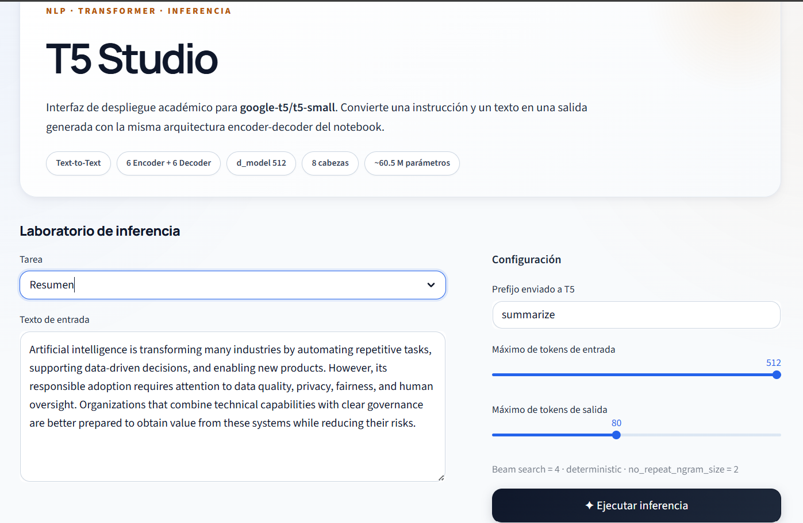


### 5.6 Despliegue

La aplicación se publica en Streamlit Community Cloud desde este repositorio, siguiendo [`DEPLOYMENT.md`](DEPLOYMENT.md). Allí normalmente corre en CPU, así que los tiempos son mayores que en las capturas, tomadas con GPU.

---

## 6. Resultados y análisis

### 6.1 Pruebas propias en la interfaz

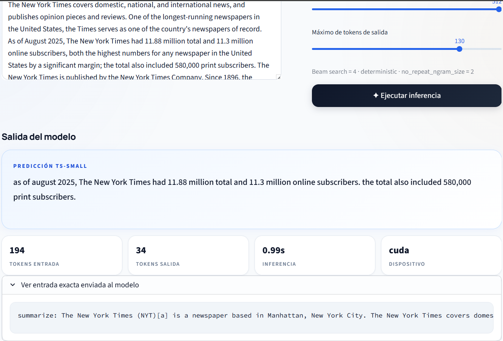
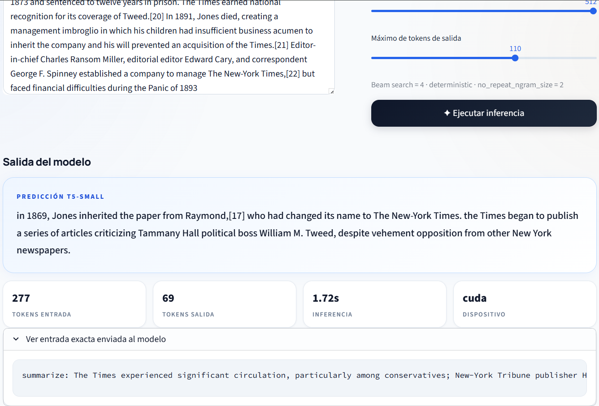
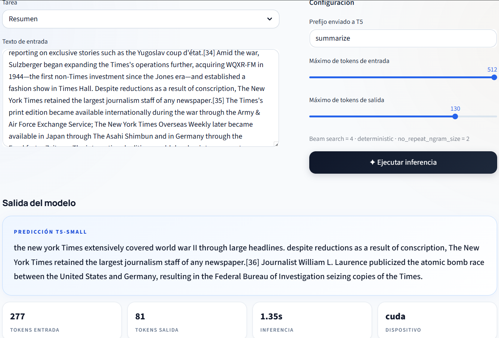
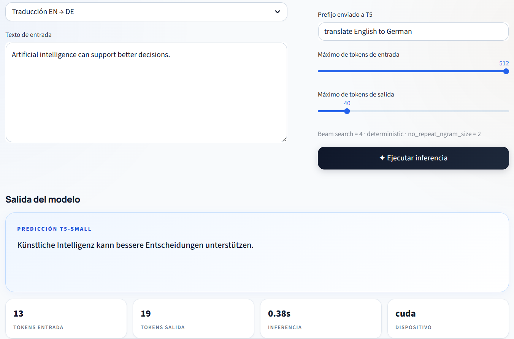

| Prueba | Tarea | Tokens entrada | Tokens salida* | Tiempo | Dispositivo |
|---|---|---:|---:|---:|---|
| 1 | Resumen | 194 | 34 | 0,99 s | CUDA |
| 2 | Resumen | 277 | 69 | 1,72 s | CUDA |
| 3 | Resumen | 277 | 81 | 1,35 s | CUDA |
| 4 | Traducción EN → DE | 13 | 19 | 0,38 s | CUDA |

\* En estas capturas el conteo incluía el token `<pad>` inicial; en la versión actual de la aplicación ya se descuenta.

En la traducción, *"Artificial intelligence can support better decisions."* se convirtió en *"Künstliche Intelligenz kann bessere Entscheidungen unterstützen."*, con el verbo al final como corresponde en alemán. El tiempo depende sobre todo de cuántos tokens se generan, porque el decoder corre una vez por token (y con 4 haces), mientras que el encoder procesa toda la entrada en paralelo. Por eso las pruebas 2 y 3 tienen la misma entrada y tiempos distintos.

### 6.2 Arquitectura y parámetros

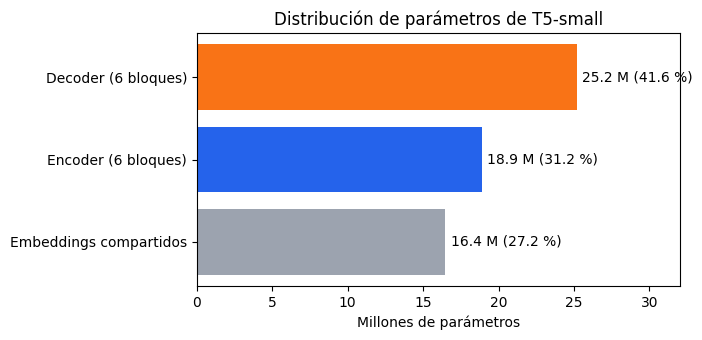

El decoder concentra el 42 % de los parámetros por la atención cruzada. Dentro de cada bloque, la feed-forward tiene el doble de parámetros que la atención (2.097.152 frente a 1.048.576).

### 6.3 Atención del encoder

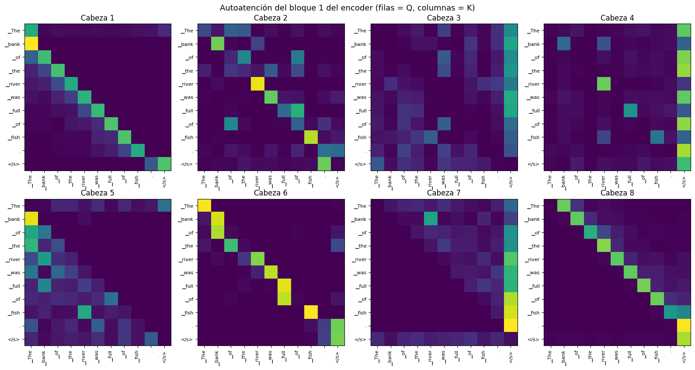

Cada cabeza del primer bloque se especializa en un patrón de posición: las cabezas 1 y 5 miran al token anterior (la 1 con el 67 % del peso), la 8 al siguiente (76 %), la 2 y la 6 a sí mismas, y la 3, la 4 y la 7 mandan casi todo el peso a `</s>`, que usan como "lugar neutro". Estos patrones vienen del sesgo relativo:

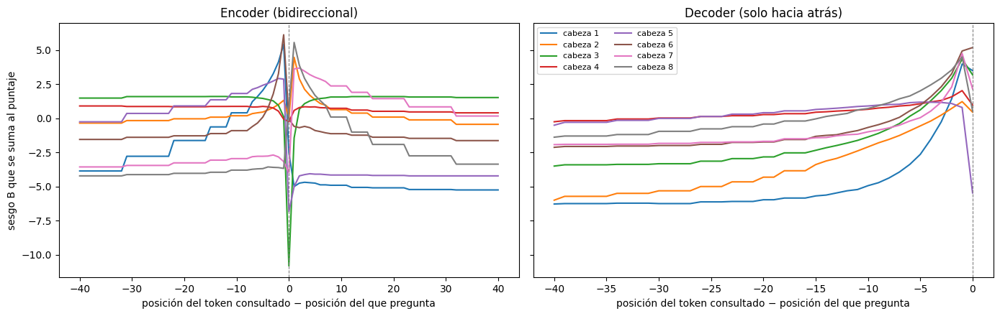

La cabeza 1 tiene su pico en −1, la 8 en +1 y la 3 un sesgo muy negativo en 0 (por eso casi no se mira a sí misma). Las distancias cortas tienen cada una su propio cajón y las largas se agrupan de forma logarítmica hasta 128. Todo el sesgo cuesta 256 parámetros en el encoder y se reutiliza en los 6 bloques.

En el ejemplo de *bank*, el vector de la palabra es idéntico en las tres frases antes del encoder (similitud 1,0). Después de las 6 capas, los dos *bank* de dinero quedan con similitud 0,67 entre sí y solo 0,46 y 0,39 con el del río: el contexto separa los dos significados. Curiosamente, *bank* casi no le pone atención directa a *river* (del 14 % en el primer bloque al 2 % en el último): la información llega de forma indirecta, lo que muestra que los mapas de atención no cuentan toda la historia.

### 6.4 Atención del decoder

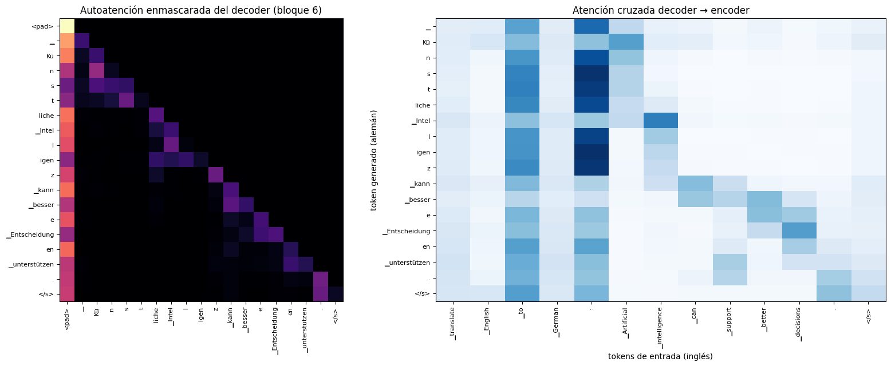

A la izquierda, la autoatención enmascarada: el peso por encima de la diagonal es exactamente 0, el decoder no ve tokens futuros. A la derecha, la atención cruzada. La alineación salió perfecta: todas las piezas de *Künstliche* miran a *Artificial*, las de *Intelligenz* a *intelligence*, *kann* a *can*, *besser* a *better*, *Entscheidung* a *decisions* y *unterstützen* a *support*, aunque en alemán el verbo esté al final de la frase.

### 6.5 Generación paso a paso

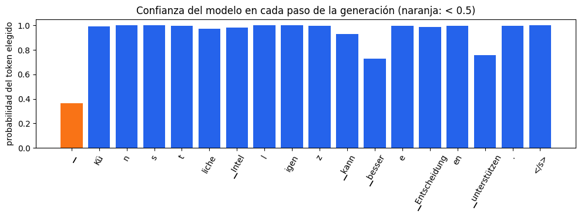

En cada paso el modelo asigna una probabilidad a los 32.128 tokens posibles. La figura muestra la del token escogido. El único paso dudoso fue el primero (0,37), donde dudaba entre empezar con *Künstliche* o con el artículo *Die*; en *unterstützen* (0,76) la alternativa fue el sinónimo *fördern*. La perplejidad fue 1,10 y greedy y beam search dieron la misma traducción.

### 6.6 Pruebas propias del notebook

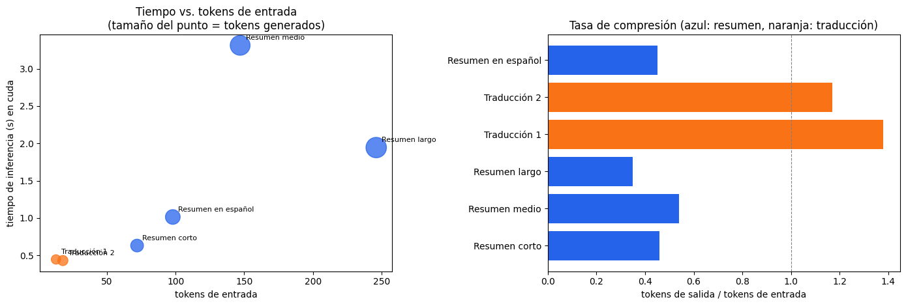

| Prueba | Tokens entrada | Tokens salida | Tiempo (GPU) |
|---|---:|---:|---:|
| Resumen corto | 72 | 33 | 0,63 s |
| Resumen medio | 147 | 80 | 3,31 s |
| Resumen largo | 246 | 85 | 1,94 s |
| Traducción 1 | 13 | 18 | 0,45 s |
| Traducción 2 | 18 | 21 | 0,43 s |
| Resumen en español | 98 | 44 | 1,01 s |

Los resúmenes copian casi textuales las primeras oraciones del texto. La traducción 2 (*"Am Donnerstag präsentierten die Studenten ihr letztes Projekt über Transformatoren"*) muestra un problema de ambigüedad como el de *bank*: tradujo *transformers* como transformadores eléctricos y *final project* como "último proyecto". El tiempo del resumen medio, mayor que el del largo, lo atribuimos a variación de la medición en la GPU compartida de Colab (una sola corrida por prueba).

### 6.7 Métricas de calidad

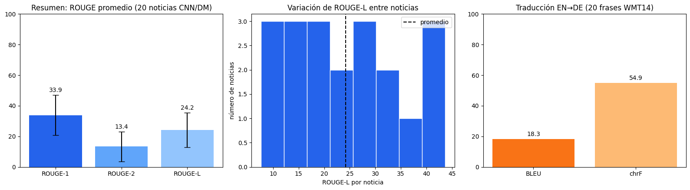

| Tarea | Datos | Métrica | Resultado |
|---|---|---|---:|
| Resumen | 20 noticias CNN/DailyMail (test) | ROUGE-1 / ROUGE-2 / ROUGE-L | 33,9 / 13,4 / 24,2 |
| Traducción | 20 frases WMT14 EN-DE (test) | BLEU / chrF | 18,3 / 54,9 |

El paper reporta para T5-Small alrededor de 19–20 de ROUGE-2 en CNN/DailyMail y 26–27 de BLEU en WMT inglés-alemán, así que quedamos por debajo. Lo atribuimos a cuatro causas: la muestra de 20 ejemplos (la desviación de ROUGE-2 es 9,7, casi tan grande como el promedio), el `no_repeat_ngram_size=2` de la app, que prohíbe repetir cualquier par de palabras y castiga ROUGE-2, parámetros de generación distintos a los del paper, y que las primeras 20 frases de WMT14 son de una misma noticia local con nombres propios y expresiones difíciles.

La diferencia entre BLEU (18,3) y chrF (54,9) muestra el límite de BLEU: una traducción correcta escrita con otra construcción, como *"Gestern hat der Bürgermeister von Gutacht eine klare Antwort auf diese Frage gegeben"*, obtuvo solo 4,0 de BLEU. En resumen, el mejor caso (ROUGE-L 43,7) fue una noticia con los hechos principales al inicio y el peor (7,6) una columna de opinión, donde el modelo escogió otra parte del texto como lo importante.

---

## 7. Conclusiones

Calcular la atención a mano y obtener exactamente los mismos pesos que el modelo fue lo que más nos ayudó a entenderla: Q, K y V son tres proyecciones lineales de los mismos vectores, y la atención decide con porcentajes cuánto toma cada token de los demás. En el camino encontramos dos detalles propios de T5 que no esperábamos: no divide por $\sqrt{d_k}$ y la posición entra como un sesgo dentro de la atención.

También entendimos por qué el Transformer reemplazó a las RNN y LSTM: en lugar de pasar todo el pasado por $h(t)$, cada token del decoder consulta directamente la memoria del encoder. La atención cruzada de la traducción y el ejemplo de *bank* lo mostraron de forma muy clara.

El aporte principal de T5 es la formulación texto a texto: un solo modelo resume y traduce cambiando el prefijo, sin tocar la arquitectura. En los resultados, T5-small tradujo con buena calidad (chrF 54,9) y resumió de forma extractiva (ROUGE-2 13,4), por debajo del paper por la muestra pequeña y nuestros parámetros de generación.

**Limitaciones:** el modelo está pensado casi todo para inglés (en español una frase usa 18 tokens contra 7 en inglés y no resume bien), se confunde con palabras ambiguas sin contexto (*transformers* → *Transformatoren*), trunca la entrada en 512 tokens, la atención crece como $n^2$, los resúmenes de la versión small son muy extractivos, solo entiende los prefijos con los que se entrenó y nuestras métricas usan una muestra pequeña.

**Posibles mejoras:** fine-tuning con textos en español o usar mT5, evaluar con más ejemplos y sin `no_repeat_ngram_size`, comparar con T5-base y agregar más tareas texto a texto.

---

## 8. Referencias

[1] C. Raffel, N. Shazeer, A. Roberts, K. Lee, S. Narang, M. Matena, Y. Zhou, W. Li y P. J. Liu, "Exploring the limits of transfer learning with a unified text-to-text transformer," *J. Mach. Learn. Res.*, vol. 21, no. 140, pp. 1–67, 2020.

[2] A. Vaswani *et al.*, "Attention is all you need," en *Proc. Adv. Neural Inf. Process. Syst. (NeurIPS)*, 2017, pp. 5998–6008.

[3] D. Bahdanau, K. Cho y Y. Bengio, "Neural machine translation by jointly learning to align and translate," en *Proc. Int. Conf. Learn. Represent. (ICLR)*, 2015.

[4] S. Hochreiter y J. Schmidhuber, "Long short-term memory," *Neural Comput.*, vol. 9, no. 8, pp. 1735–1780, 1997.

[5] P. Shaw, J. Uszkoreit y A. Vaswani, "Self-attention with relative position representations," en *Proc. NAACL-HLT*, 2018, pp. 464–468.

[6] B. Zhang y R. Sennrich, "Root mean square layer normalization," en *Proc. Adv. Neural Inf. Process. Syst. (NeurIPS)*, 2019.

[7] T. Kudo y J. Richardson, "SentencePiece: A simple and language independent subword tokenizer and detokenizer for neural text processing," en *Proc. EMNLP: System Demonstrations*, 2018, pp. 66–71.

[8] F. Chollet, *Deep Learning with Python*, 2.ª ed. Shelter Island, NY, EE. UU.: Manning, 2021.

[9] C.-Y. Lin, "ROUGE: A package for automatic evaluation of summaries," en *Text Summarization Branches Out*, 2004, pp. 74–81.

[10] K. Papineni, S. Roukos, T. Ward y W.-J. Zhu, "BLEU: A method for automatic evaluation of machine translation," en *Proc. ACL*, 2002, pp. 311–318.

[11] Google Research, "T5: Text-To-Text Transfer Transformer," *GitHub*. [En línea]. Disponible: https://github.com/google-research/text-to-text-transfer-transformer

[12] Hugging Face, "T5," *Transformers Documentation*. [En línea]. Disponible: https://huggingface.co/docs/transformers/model_doc/t5

[13] Hugging Face, "google-t5/t5-small," *Model Hub*. [En línea]. Disponible: https://huggingface.co/google-t5/t5-small

[14] Streamlit, "Streamlit documentation." [En línea]. Disponible: https://docs.streamlit.io/
